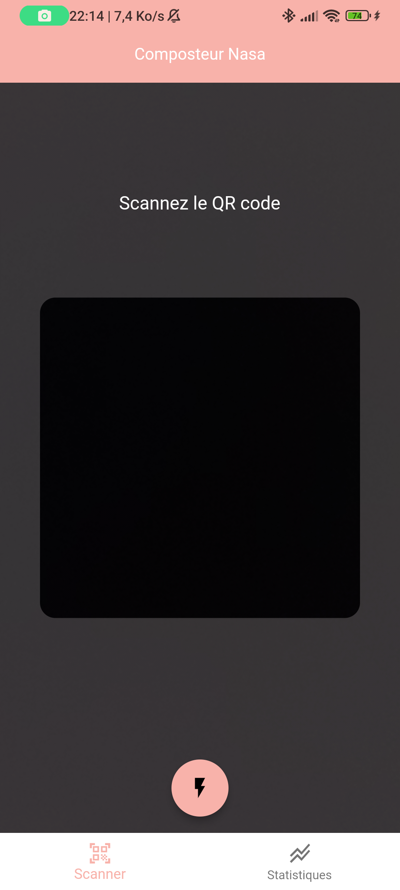
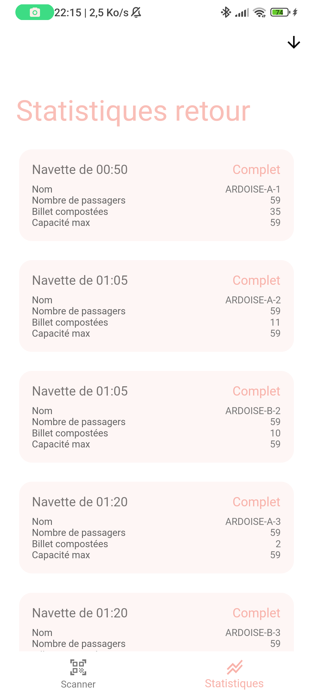

# 📱Scanneur de navettes

Scanner pour composter les billets de navettes pour la soirée NASA 2023.
Totalement adaptable pour tout autre événement.

> **Note:** Ce projet utilise firebase sous sa forme actuelle.

## ✏️Personaliser le projet

### 🧠Logique

Le projet peut être adapté à d'autres services que firebase en étendant les classes de services.

- **statistics**: Service de statistiques
- **ticket validator**: Service de verification/validation des billets

### Thème

Le thème de l'application peut être modifié en modifiant le fichier `src/ui/style/colors.dart`.

## Visualisations

